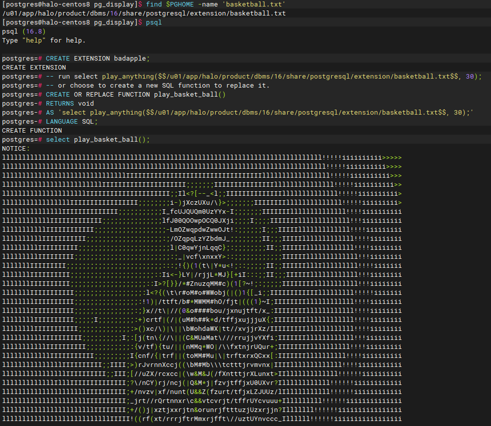

# pg_display

Play "Bad Apple!!" in the psql client. This demo is to illustrate that the psql client can play some animation.

## Install

```bash
make PG_CONFIG=<path to pg_config> install
```

## Run
### badapple
```sql
-- In psql client.
CREATE EXTENSION badapple;
SELECT play_badapple();
```
### or you like sing, dance, rap and basketball.
```sql
-- In psql client.
CREATE EXTENSION badapple;
SELECT play_basketball();
```
### other
You can also use "play_anything" to display other interesting videos that you want to see.

However, this requires you to know the specific file path and the number of lines of data for each frame.



You can choose to use [video-to-ascii](https://github.com/joelibaceta/video-to-ascii) to generate the corresponding file.

## Reference

- [Fun with PostgreSQL Puzzles: Recursive Functions with Animations](https://www.crunchydata.com/blog/fun-with-postgresql-puzzles-and-recursive-functions-with-animations)
- [ANSI/VT100 Terminal Control Escape Sequences](https://web.archive.org/web/20190624214929/http://www.termsys.demon.co.uk/vtansi.htm)
- [Chion82/ASCII_bad_apple](https://github.com/Chion82/ASCII_bad_apple)
- [video-to-ascii](https://github.com/joelibaceta/video-to-ascii)
